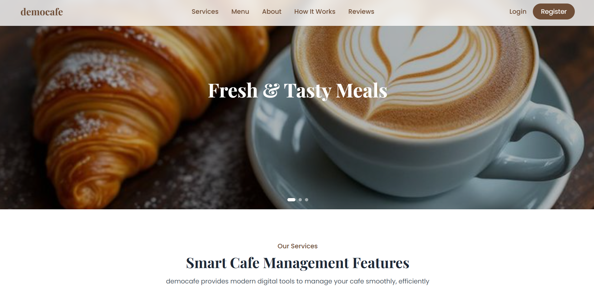
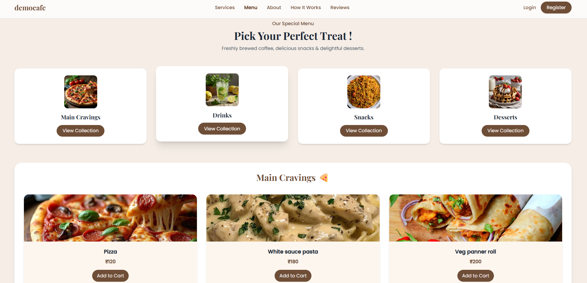
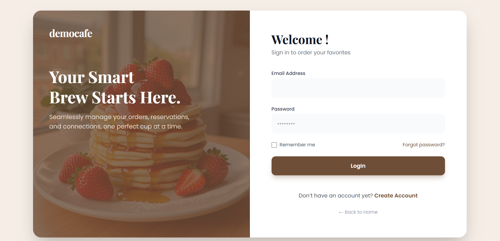
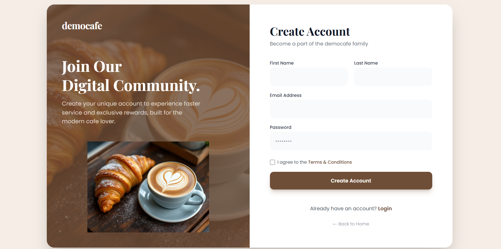

 Smart Cafe Management System – DemoCafe

A modern and fully responsive landing page for DemoCafe. This project demonstrates a smart cafe experience with a clean user interface, interactive menu sections, and smooth navigation.

# Key Features

- Responsive design that adapts to desktops, tablets, and mobile devices.
- Dynamic menu system with organized food and drink categories.
- Interactive UI with smooth hover effects and transitions.
- Mobile-friendly navigation with a functional hamburger menu.
- Clean and user-focused interface for better usability.

# Technologies Used

- HTML5. 
- Tailwind CSS. 
- JavaScript (Vanilla JS). 
- LocalStorage. 

# Purpose of the Project

- To strengthen frontend development skills through a practical project.
- To design a modern user interface for a cafe or food business website.
- To practice responsive design using Tailwind CSS layout systems.
- To implement dynamic menu rendering using JavaScript.
- To create a portfolio-ready project for internships and job opportunities.

# Project Sections

- Login and Registration forms for user access.
- Dynamic Cafe Menu with multiple food categories.
- Services section describing café offerings.
- About section explaining the concept of DemoCafe.
- How It Works section guiding users through the process.
- Customer Feedback section displaying user reviews.

# Live Demo

🔗 Live Website: https://ishwariwadnare.github.io/Democafe/

# Screenshots

### Home Page

### Menu Section

### Login Page

### Registration View

# Author

Ishwari Wadnare  
Frontend Developer| Computer Science Engineering Student
